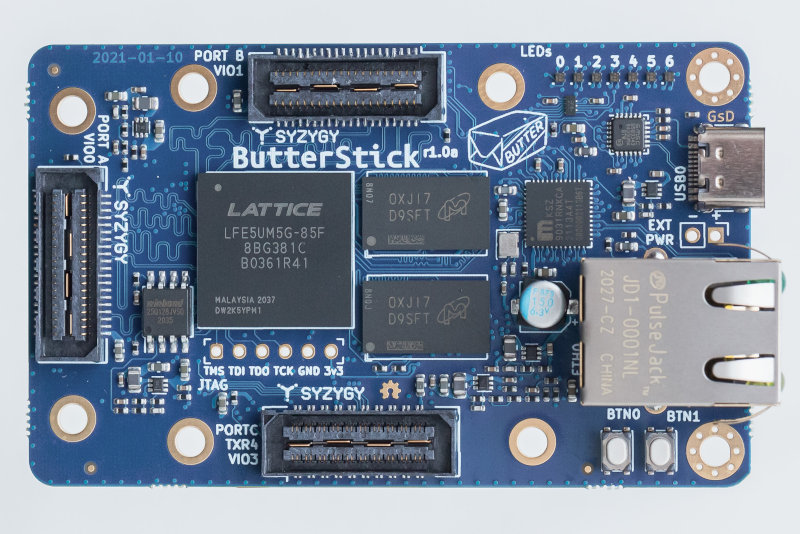
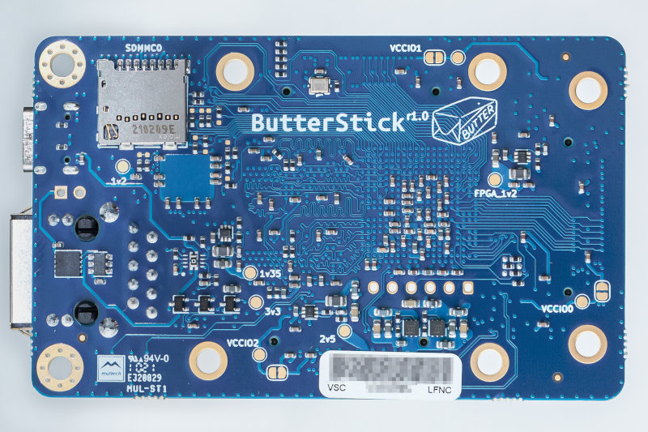

# ButterStick

    A compact Lattice ECP5 based development board with breakouts for lots of high-speed I/O and serdes.

    With onboard DDR3, High Speed USB and Ethernet.

## Latest Revision: 
* __Latest Release:__ [ButterStick r1.0](hardware/ButterStick_r1.0/) 
  * Assembled PCBs available: [GroupGets](https://store.groupgets.com/products/butterstick-fpga-development-board)
  * Bare PCBs available: [Tindie](https://www.tindie.com/products/greeeg/butterstick-r10-bare-circuit-board)

Previous Revisions:
* [ButterStick r0.2](hardware/ButterStick_r0.2/)
* [ButterStick r0.1](hardware/ButterStick_r0.1/)

## Hardware (r1.0)

* ECP5 25F/45F/85F (BGA381 package)
* USB 2.0 High Speed (480 Mbit/s)
* Gigabit Ethernet
* upto 8Gbit DDR3L RAM (dual rank)
* 128Mbit QSPI FLASH Memory (Bitstream + User storage)
* MicroSD socket (4 bit SD interface)
* Onboard oscillators:
  * 60 MHz
  * 25 MHz (RGMII PHY)
* 0.1" pitch JTAG connector
* 7x User RGB LEDs
* 2x User Buttons
* 2x Standard [SYZYGY compatible connectors](https://syzygyfpga.io/)
  * Adjustable VCCIO 1.2V-3.3V
  * Up to 32 single ended I/O
  * 10 differential pairs
  * Dedicated clock input pins
* 1x Transceiver [SYZYGY compatible connector](https://syzygyfpga.io/)
  * Adjustable VCCIO 1.2V-3.3V
  * Up to 14 single ended I/O
  * 2x/4x Lanes TX (5 Gbps SERDES)
  * 2x/4x Lanes RX (5 Gbps SERDES)
  * 1x Reference clock input

Board dimensions: 80mm x 49mm

### Variants

The ButterStick can be configured in different variants,
the part number defines which FPGA and DDR3 parts are installed.

`ButterStick-r1.0-[Memory gigabits]-[FPGA density]`

|       | ButterStick-r1.0-2G-25F | ButterStick-r1.0-2G-85F | ButterStick-r1.0-8G-85F | 
|-------|-------------------------|-------------------------|-------------------------|
| FPGA  | LFE5UM5G-25F-8BG381C    | LFE5UM5G-85F-8BG381C    | LFE5UM5G-85F-8BG381C    | 
| DDR3  | 2x MT41K64M16TW-107     | 2x MT41K64M16TW-107     | 2x MT41K256M16TW-107    |

The 25F also has the following limitations on the ButterStick:
* 25F Only provides 2x SERDES lanes.
* 25F does not connect I/O pins S8/S9 on SYZYGY.C

## Licence

 * Hardware in this repository is licenced under CERN OHL v1.2
