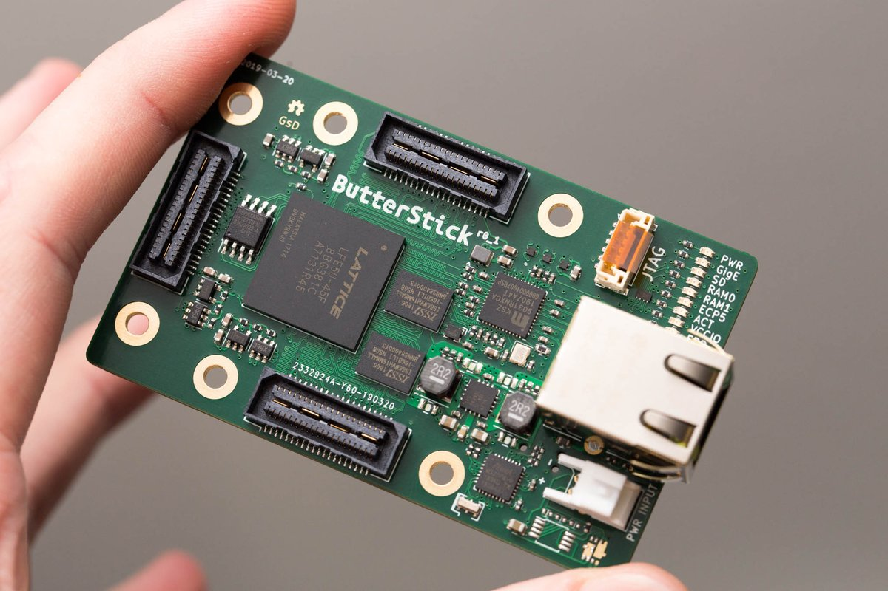
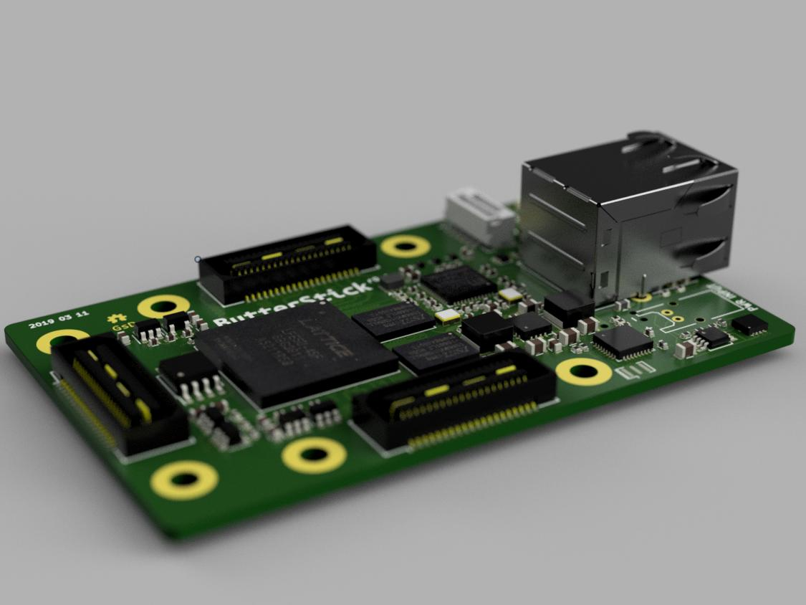
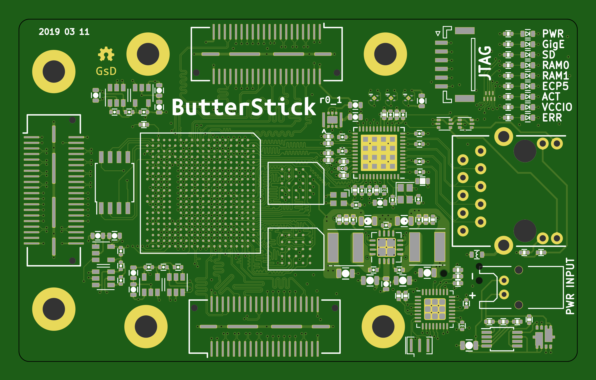
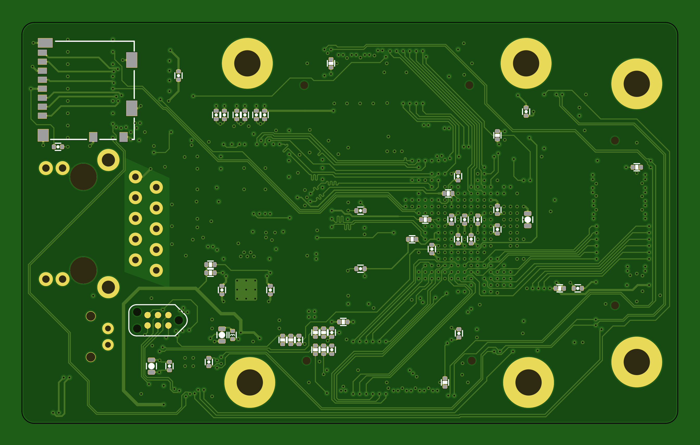

# ButterStick

## A simple FPGA board for experiments with high speed LVDS interfaces. 3 Standard connectors with an onboard GigE link.

	Still in active Development (Use stuff here if you want, but there is no support.)

## Hardware

* ECP5 
* Dual 8MB/16MB HyperRAM. high density, low pin count.
* 16MB QSPI Memory
* MicroSD socket
* TCXO Oscillator
* JST GH SM06 locking Data/Power connector (low current)
* JTAG on GH SM06
* 1x LED
* 3x Stardard SYZYGY compatible connectors
* Power:
  * 3.3V/3A
  * 5V/2A  
  * Adjustable VCCIO 1.2V-3.3V/150mA (per bank)

## r0_1 Errata

 * SYZYGY port 1 & 3 are not horizontally aligned
 * Resistor values for OV/UV protection circuit.