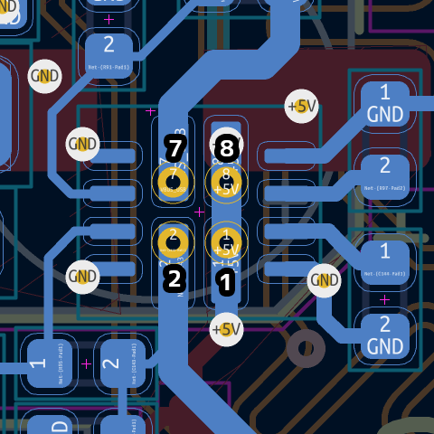

> Company: GsD / GroupGets  
> Project: ButterStick r1.0 

# Engineering Change Notice (ECN)

|||
|-|-|
**ECN Number** | 001  
**Origination Date** | Friday, 27th August, 2021
**Originator of Change** | Gregory Davill
**Project Name** | ButterStick r1.0
**Type of Action** | Part Substitution
**Reason for Change** | Remove difficult to source component from design

## Detailed description of changes

### Replace BOM item `U18`  
   ||Mfg|Part|
   |-|-|-|
   **Old** | Texas Instruments| TPS2121RUXR  
   **New** | YAGEO| RC0603JR-130RL  

### Populate new part on PCB
   Install `U18` such that it shorts pins 1,2 and 7,8 of `U18`  
   {width=40%} {width=40%}  

> Note CAD view is Top view (Through the PCB). Whereas render view is Bottom View.

## QC checks

 Skew of `U18` is acceptable, and expected.  
 Acceptance criteria on soldering is that it's successfully soldered across pins 1,2 and 7,8 of `U18`