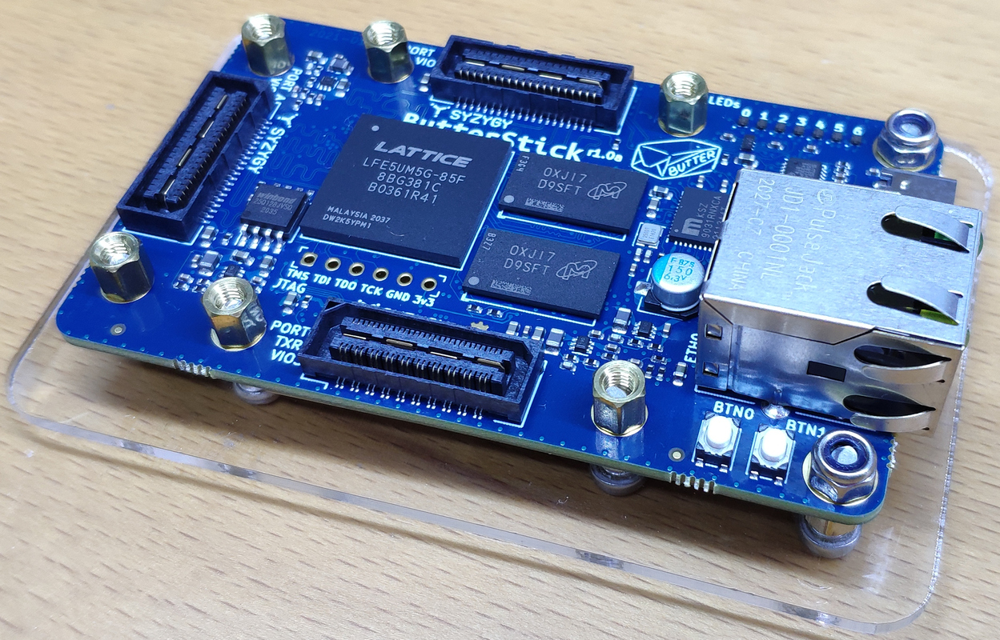
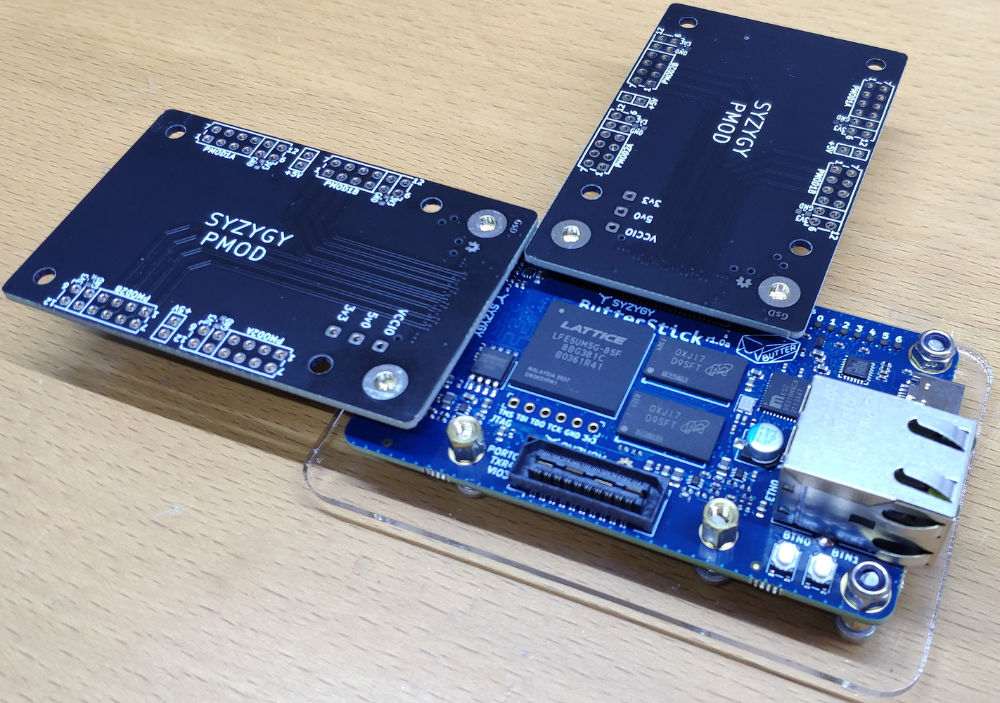

# Acrylic Plate for Butterstick

This is a basic acrylic plate for butterstick described in openscad.  A dxf file is included for laser cutting.

It was cut in 3mm acrylic. The hardware is all M3, the bolts are 12mm long, the spacers are 5mm high.

Files are free to use in any form, no warranty is offered or implied.

